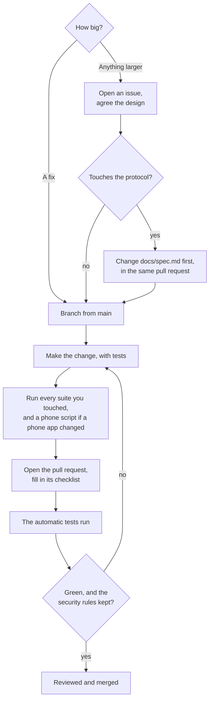

# Contributing

Issues and pull requests are welcome. Everyone taking part follows the
[code of conduct](CODE_OF_CONDUCT.md).

## Before you start

- Read [docs/spec.md](docs/spec.md). It is the source of truth for the protocol; code follows it,
  not the other way round. A protocol change starts as a spec change in the same pull request.
- Read the security rules in [README.md, section 9](README.md#9-security-rules). A change that
  breaks one of them will not be merged, however useful it is.
- For anything larger than a fix, open an issue first so the design can be agreed before the work.

## How a change gets in



## First time

1. Install Node 24 or newer and Xcode 26 or newer; for the Android app, Android Studio (it brings
   a JDK 17 and the Android SDK).
2. Clone the repository and run `npm install` at its root.
3. Run `npm test` and `(cd packages/swift && swift test)` to check the setup. Both should pass on
   a fresh clone, with no permissions and no devices.

## Building and testing

The commands are in [README.md, section 8](README.md#8-building-and-testing). Every suite you touch
must pass. If you change a schema or a key table, regenerate the vectors and code:

```sh
cd packages/protocol && npm run vectors && npm run codegen
```

and make sure the Swift and Kotlin vector tests still agree with them. The iPhone app runs the
Swift implementation, so it needs no vectors of its own, but a change to its gestures or keys should
keep `swift test` in `apps/ios/OwnDeskTouch` and `scripts/test-ios-simulator.sh` passing. A change
to the terminal should keep `swift test` in `packages/terminal` passing, which starts the Mac's own
`sshd` on a spare port, and the emulator tests in the Android suite.

Two end-to-end scripts run the phone apps against the real host binary. `scripts/test-ios-simulator.sh`
needs only Xcode and a Simulator. `scripts/test-android-device.sh` needs an Android phone on adb and
on the same network as the Mac; run it when you change the Android app's pairing, session or
terminal, and say in the pull request whether you could. Neither changes anything outside its
temporary folder: the host is headless with a throwaway identity, and the SSH server is your own
`sshd` on a spare port with a key file of its own. The one exception is the phone's clipboard (the
Simulator's, or the Android phone's), which ends up holding the host's test line.

## Pull requests

The automatic tests run on every pull request: the protocol, Android unit and Swift suites and the
end-to-end run against the agent binary. The pull request template's checklist covers the rest.

- Keep each pull request to one change, with tests for it.
- Match the style of the code around it.
- Never commit real keys, pairing codes, addresses of your own machines, or logs from a session.
- Never commit your Apple team ID or a bundle identifier of your own. They go in
  `apps/ios/Config/Local.xcconfig`, which git ignores; README section 6.4 shows how. Do not choose a
  team in Xcode's Signing & Capabilities tab, which writes it into the shared project file.

## Security issues

Do not report them in public issues or pull requests. See [SECURITY.md](SECURITY.md).

By contributing you agree that your contribution is licensed under the [MIT License](LICENSE).
