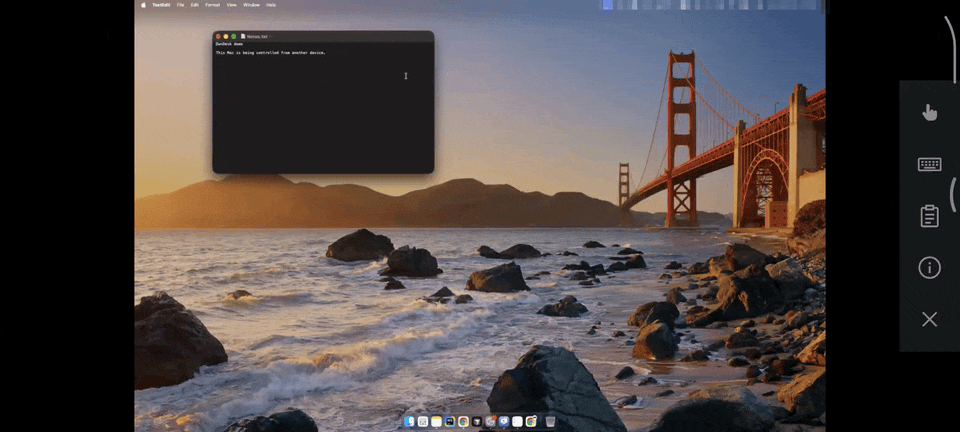
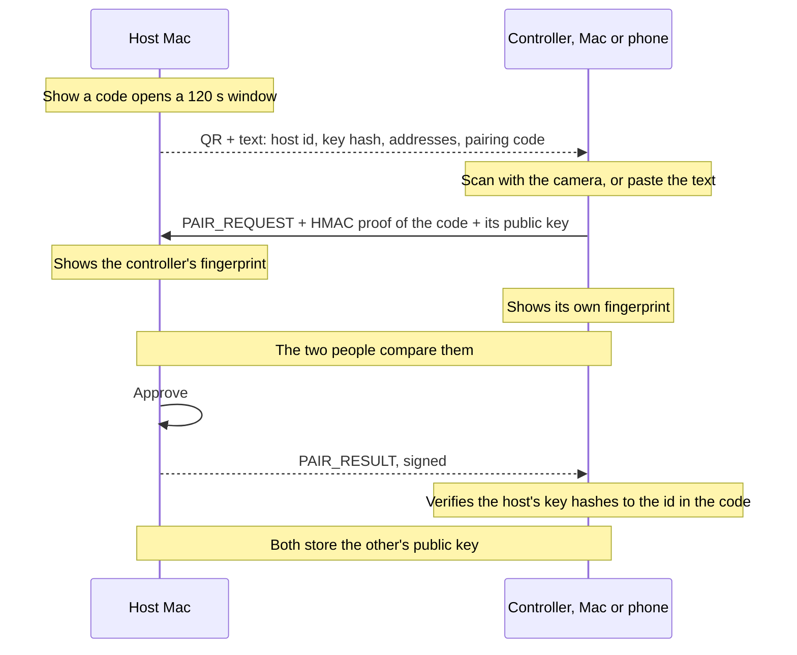
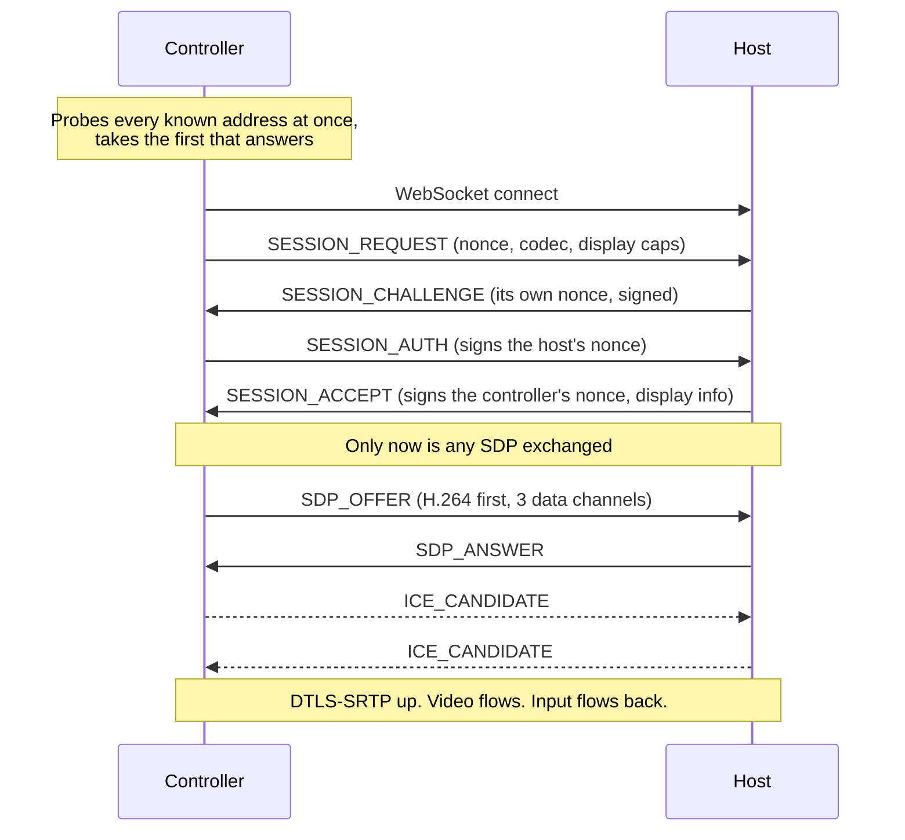
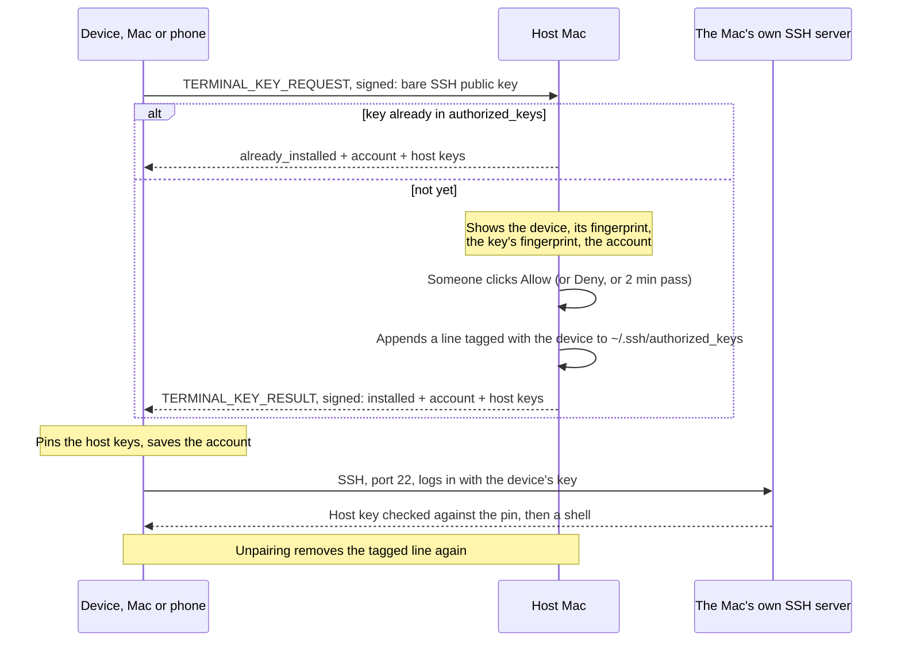
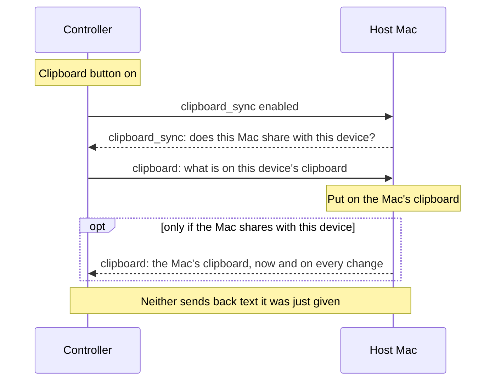
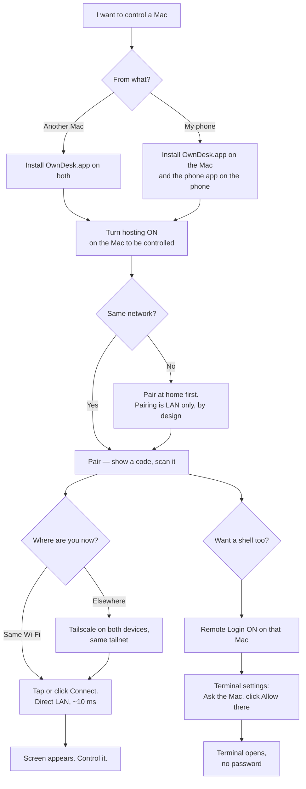
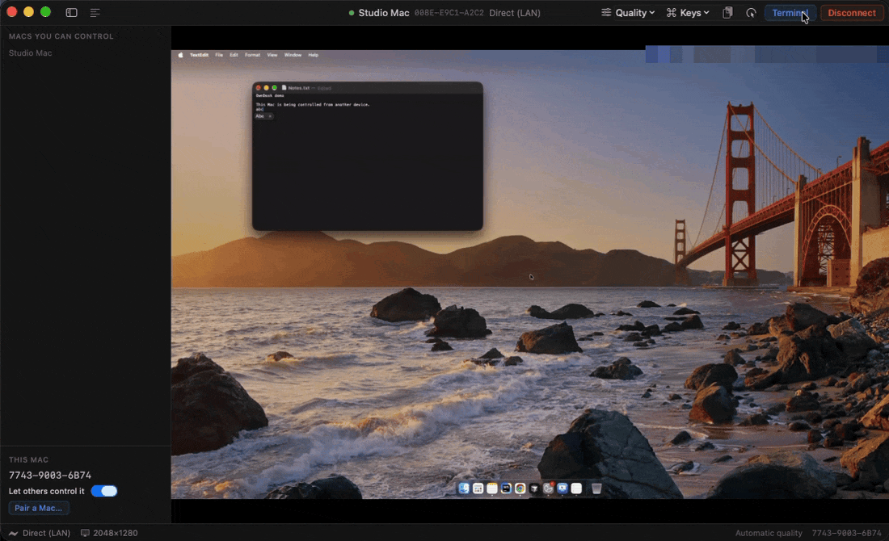
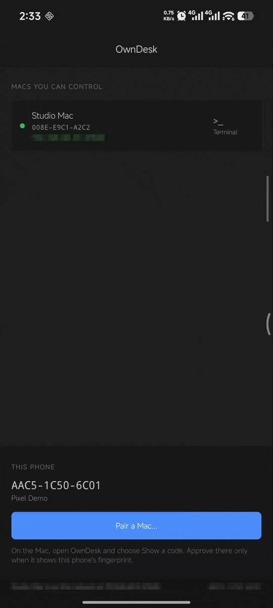
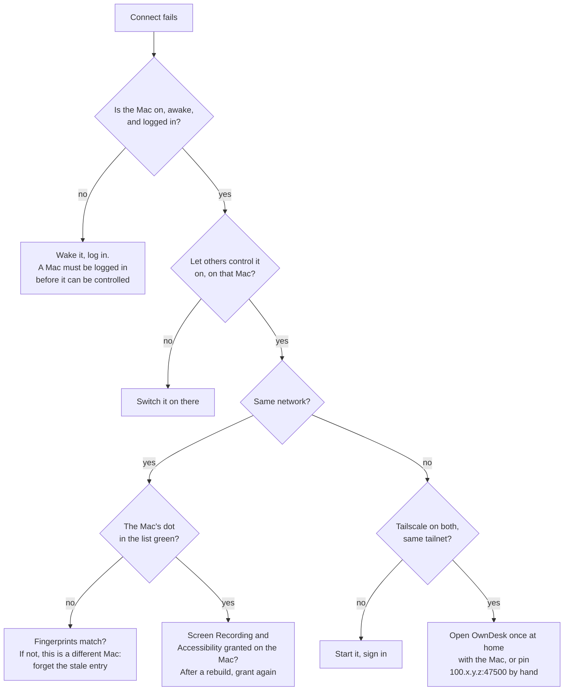

# OwnDesk

Private remote control for your own devices.

Control a Mac from another Mac, an Android phone or an iPhone (screen, mouse, trackpad, touch and keyboard)
with no account, no cloud service, and no port open to the Internet. Devices pair once by scanning
a code. Every session is end-to-end encrypted over WebRTC, and every message that sets one up is
signed by a key that never leaves its device, so neither the network, nor a relay, nor anything in
the middle can impersonate a device, read a session, or inject a keystroke.

Each controller can also open a terminal on a Mac. That is the Mac's own SSH server (Remote Login)
with OwnDesk as the client: the protocol above still carries no command, and each device logs in
with an SSH key of its own, hardware-backed like its identity.

<p align="center">
  
  <br><sub>An Android phone controlling a Mac: typing into a note, zooming in, trackpad mode.</sub>
</p>

**Runs on:** macOS 14+ (host and controller; the download is for Apple silicon, Intel Macs build from
source) · Android 8+ (controller) · iOS 17+ (controller)<br>
**Away from home:** through [Tailscale](https://tailscale.com), with no port forwarding<br>
**Status:** early, used daily on the author's own devices

[Quick start](#quick-start) · [How it works](#3-architecture) · [Security](SECURITY.md) ·
[The design](docs/spec.md) · [What was built](docs/implementation.md) · [License: MIT](LICENSE)

## Quick start

1. **On the Mac to be controlled**, download `OwnDesk-…-macos.zip` from
   [Releases](https://github.com/im-fahad/OwnDesk/releases), unzip it, and follow `INSTALL.txt`
   inside: clear the download mark, run `scripts/install-owndesk.sh`. Open OwnDesk from the menu bar
   and switch on **Let others control it**; allow Screen Recording and Accessibility when macOS asks.
2. **On the controlling device**:
   - another Mac: the same download;
   - an Android phone: `OwnDesk-…-android.apk` from the same release, opened on the phone;
   - an iPhone: built from source with your own Apple ID, see [section 6.4](#64-install-on-an-iphone).
3. **Pair**, on the same Wi-Fi: on the Mac, **Pair a Mac… → Show a code**; scan it with the phone or
   paste it on the other Mac. Check that the fingerprints match, then **Approve** on the Mac.
4. **Connect**: tap or click the Mac. For a terminal too, turn on Remote Login on that Mac and use
   the **Terminal** button.

Away from home, install [Tailscale](https://tailscale.com) on both devices; nothing else changes.
Prefer to build it yourself? [Section 6](#6-user-guide) has every step.

## How it compares

| | OwnDesk | RustDesk | Chrome Remote Desktop | TeamViewer |
|---|---|---|---|---|
| Account needed | No | No | A Google account | A TeamViewer account, for unattended access |
| Open source | Yes, MIT | Yes, AGPL-3.0 | No | No |
| Who brokers the connection | Nobody: direct on your network, your own tailnet away | RustDesk's public servers, unless you run your own | Google | TeamViewer |
| Devices that can be controlled | Macs | Windows, Mac, Linux, Android | Windows, Mac, Linux | Most platforms |
| Cost | Free | Free; paid server option | Free | Free for personal use; paid for business |

Where OwnDesk falls short today: only Macs can be controlled, there is no file transfer or audio
yet, the Mac app is signed without an Apple certificate, so macOS asks you to confirm it once, and
the iPhone app must be built from source. It suits someone who wants to reach their own Macs with
nothing in between, not a help desk. Beside the screen it also gives each device a terminal on the
Mac, through the Mac's own SSH server.

**Contents** — [Quick start](#quick-start) · [How it compares](#how-it-compares) · [The devices](#1-the-devices) · [Technology](#2-technology) ·
[Architecture](#3-architecture) · [The two halves](#4-the-two-halves-hosting-and-controlling) ·
[Full flow](#5-full-flow-from-a-cold-machine-to-a-moving-picture) ·
[User guide](#6-user-guide) · [Repository](#7-repository-layout) ·
[Building and testing](#8-building-and-testing) · [Security rules](#9-security-rules) ·
[Not built](#10-not-built) · [License](#11-license)

---

## 1. The devices

| Device | Runs | Can host | Can control |
|---|---|---|---|
| Mac mini | `OwnDesk.app` | yes | yes |
| MacBook | `OwnDesk.app` | yes | yes |
| Android phone | `OwnDesk` (`io.github.im_fahad.owndesk`) | no | yes |
| iPhone or iPad | `OwnDesk` (`apps/ios`), built with your own Apple ID | no | yes |

One Mac app fills both roles. A Mac can be controlled, control another, or do both at once.
Hosting is a switch that is **off** until you turn it on, so installing the app never makes a Mac
remotely controllable on its own. The phones only control, which is why their apps are much smaller.

Every controller has two ways in to a paired Mac: its screen, and a terminal. The terminal is a
shell through the Mac's own Remote Login, so it needs that switched on there, and it works whether
or not the Mac has let this device control its screen.

---

## 2. Technology

### Shared, and the reason it is shared

| Piece | Choice | Why |
|---|---|---|
| Identity key | ECDSA P-256, SHA-256 | The curve both the Secure Enclave and the Android Keystore back in hardware. Ed25519 is backed by neither. |
| Signature format | Raw `r‖s`, 64 bytes, base64url | Identical on three platforms; Android converts from DER |
| Device id | SHA-256 of the 65-byte X9.63 public key | Self-certifying: the id proves which key it belongs to |
| Fingerprint | The first 12 hex characters as `25AA-F3B7-4F82` | Short enough to compare by eye across a room |
| Wire format | JSON envelope, payload as base64url of the exact bytes | Avoids needing canonical JSON in three languages |
| Source of truth | JSON Schema in `packages/protocol` | Codegen produces TypeScript types and the Swift key table, so they cannot drift |
| Cross-platform proof | Shared test vectors | The same vectors are run by TypeScript, Swift and Kotlin |
| Media | WebRTC, H.264, DTLS-SRTP | Hardware encode on the Mac, hardware decode on the Mac and the phones |
| Pairing proof | HMAC-SHA256 over the pairing code | Proves possession of the code without sending it |
| Terminal | SSH to the Mac's own Remote Login | No command type in the protocol. OpenSSH authenticates, allocates the terminal and runs the shell; each device has a second P-256 key for it, hardware-backed like the identity |

### On the Mac

| Layer | Technology |
|---|---|
| Language | Swift 6 toolchain, Swift 5 language mode, macOS 14+ |
| App | SwiftUI + AppKit: a menu bar item with a window on demand |
| Key storage | Secure Enclave via `OwnDeskIdentity`, or the Keychain, or a file in development |
| Signaling transport | WebSocket over Network.framework, port 47500 |
| Discovery | Bonjour, `_owndesk._tcp`, device id in the TXT record |
| Screen capture | ScreenCaptureKit → NV12 pixel buffers |
| Encode / decode | libwebrtc ([stasel/WebRTC](https://github.com/stasel/WebRTC) 152) with VideoToolbox H.264 |
| Codec choice | The controller's offer puts H.264 first and states level 5.2, so a full-size desktop is not sent as VP8 |
| Input injection | CGEvent (Quartz), with rate limits and click-count tracking |
| Video display | `RTCMTLNSVideoView`, Metal |
| Terminal | [SwiftTerm](https://github.com/migueldeicaza/SwiftTerm) 1.11 draws it; `OwnDeskTerminal` (SwiftNIO SSH) carries it; the login key is a second Secure Enclave key |
| Runs at login | LaunchAgent `io.github.im-fahad.owndesk`, restarts after a crash, not after Quit |
| Signing | Ad-hoc. No certificate, by choice: these apps never leave your machines |

### On Android

| Layer | Technology |
|---|---|
| Language | Kotlin 2.1, JDK 17, minSdk 26, target/compileSdk 36 |
| Build | Gradle 8.13, AGP 8.10.1 |
| UI | Plain Android Views, no Compose, themed to match the Mac app |
| Key storage | Android Keystore, EC P-256, non-exportable |
| Signaling transport | OkHttp WebSocket |
| JSON | kotlinx.serialization |
| Media | [webrtc-sdk](https://github.com/webrtc-sdk/android) 125.6422.07, `SurfaceViewRenderer` |
| Codec choice | Asks `MediaCodecList` what its decoder supports and offers that H.264 level, capped at 5.2 |
| QR scanning | CameraX 1.3.4 + zxing core, decoded on the phone, offline |
| Coroutines | kotlinx-coroutines 1.8.1 |
| Terminal | A VT emulator of the app's own, drawn on a Canvas; [JSch](https://github.com/mwiede/jsch) 2.28 for SSH; the login key is a second Keystore key |

### On the iPhone

| Layer | Technology |
|---|---|
| Language | Swift 6 toolchain, Swift 5 language mode, iOS 17+, iPhone and iPad |
| UI | SwiftUI for the lists and sheets, UIKit for the session screen, themed to match the Mac app |
| Session | `OwnDeskControllerCore`, the Mac controller's own core, shared rather than rewritten |
| Key storage | Secure Enclave, kept in the app's sandbox and out of backups; a software key in the Simulator |
| Media | [stasel/WebRTC](https://github.com/stasel/WebRTC) 152, `RTCMTLVideoView`, hardware H.264 decode |
| Discovery | Bonjour through Network.framework, with the Local Network permission |
| QR scanning | AVFoundation's own QR detector, on the phone, offline |
| Gestures and keys | `OwnDeskTouch`, a small package with the Android app's gesture rules, tested on the Mac |
| Terminal | SwiftTerm 1.11 and `OwnDeskTerminal`, as on the Mac |
| Signing | Your own Apple ID, kept in a git-ignored file. The Simulator needs none |

### Development tooling

Node 24 for the protocol package (ajv for schema validation), TypeScript for the reference
implementation, [werift](https://github.com/shinyoshiaki/werift-webrtc) for an end-to-end test that
speaks WebRTC without libwebrtc, and a browser harness for poking at a host by hand.

---

## 3. Architecture

```text
   ┌────────────────────────────────┐        ┌────────────────────────────────┐
   │ Mac mini · OwnDesk.app         │        │ MacBook · OwnDesk.app          │
   │                                │        │                                │
   │ hosting half — a switch, off   │        │ hosting half — a switch, off   │
   │ until you turn it on           │        │ until you turn it on           │
   │  WebSocket :47500, Bonjour     │        │  WebSocket :47500, Bonjour     │
   │  ScreenCaptureKit → H.264      │◄══════►│  ScreenCaptureKit → H.264      │
   │  CGEvent injection             │        │  CGEvent injection             │
   │                                │        │                                │
   │ controlling half — always      │        │ controlling half — always      │
   │  probes every known address    │        │  probes every known address    │
   │  offers WebRTC, renders it     │        │  offers WebRTC, renders it     │
   │                                │        │                                │
   │ shared: identity, peer list,   │        │ shared: identity, peer list,   │
   │ the window                     │        │ the window                     │
   └───────────────┬────────────────┘        └────────────────┬───────────────┘
                   │                                          │
                   └─────────────┐            ┌───────────────┘
                                 │            │
                          ┌──────┴────────────┴──────┐
                          │ Phone · OwnDesk          │
                          │  Android or iPhone       │
                          │  hardware-held key       │
                          │  controlling half only   │
                          │  touch → pointer, keys   │
                          └──────────────────────────┘

   Every line above carries the same two things:
     signalling  signed envelopes over the WebSocket the host serves
     media       WebRTC, DTLS-SRTP, H.264 video plus three data channels

   Same LAN   the controller reaches that WebSocket directly, found by Bonjour.
              No server of any kind is involved.
   Away       the same WebSocket at a Tailscale address. Tailscale connects the
              two directly when it can, and relays through DERP when it cannot.
```

Two planes, kept apart on purpose:

- **Control plane** — pairing, session authentication, SDP, ICE. Every message is a signed
  envelope. The transport is never trusted, so it does not matter who carries it.
- **Data plane** — screen video and input events. Only ever inside the WebRTC connection.
  It never touches a server, and a relay sees packets it cannot read.

---

## 4. The two halves: hosting and controlling

Inside `OwnDesk.app` there are two independent halves. They share the identity, the peer list and the
window, and nothing else.

### The hosting half — `OwnDeskAgentCore` (`apps/mac-agent`)

Constructed only when you turn hosting on, which is also when macOS is asked for Screen Recording
and Accessibility. A Mac you only control *from* never sees those prompts.

| File | Role |
|---|---|
| [SignalingServer.swift](apps/mac-agent/Sources/OwnDeskAgentCore/SignalingServer.swift) | WebSocket server on port 47500, Bonjour advertisement |
| [SessionCoordinator.swift](apps/mac-agent/Sources/OwnDeskAgentCore/SessionCoordinator.swift) | Envelope verification, pairing, the session state machine, timers, kill switch |
| [ScreenCapturer.swift](apps/mac-agent/Sources/OwnDeskAgentCore/ScreenCapturer.swift) | ScreenCaptureKit into NV12 buffers, repeating the last frame when the screen is still |
| [WebRTCSession.swift](apps/mac-agent/Sources/OwnDeskAgentCore/WebRTCSession.swift) | Answers the offer, prefers H.264, opens the video sender, classifies the path |
| [InputInjector.swift](apps/mac-agent/Sources/OwnDeskAgentCore/InputInjector.swift) | CGEvent posting: clicks, drags, scroll phases, Unicode text, relative cursor accumulation |
| [MediaSession.swift](apps/mac-agent/Sources/OwnDeskAgentCore/MediaSession.swift) | The seam between the coordinator and the real capture + encode stack |
| [PowerAssertion.swift](apps/mac-agent/Sources/OwnDeskAgentCore/PowerAssertion.swift) | Keeps the Mac awake while a session is live |
| [AuthorizedKeys.swift](apps/mac-agent/Sources/OwnDeskAgentCore/AuthorizedKeys.swift) | A paired device's terminal key into `~/.ssh/authorized_keys` after an Allow, tagged, and out again on unpairing |

### The controlling half — `OwnDeskControllerCore` (`apps/mac-controller`)

| File | Role |
|---|---|
| [HostDiscovery.swift](apps/mac-controller/Sources/OwnDeskControllerCore/HostDiscovery.swift) | Bonjour browser for hosts on this network |
| [Endpoints.swift](apps/mac-controller/Sources/OwnDeskControllerCore/Endpoints.swift) | Address parsing, and probing every known address at once |
| [PairingClient.swift](apps/mac-controller/Sources/OwnDeskControllerCore/PairingClient.swift) | `PAIR_REQUEST` with proof, and checking the reply against the code's key hash |
| [SessionClient.swift](apps/mac-controller/Sources/OwnDeskControllerCore/SessionClient.swift) | Authentication, the offer, ICE, keepalive, reconnection, teardown |
| [WebRTCClient.swift](apps/mac-controller/Sources/OwnDeskControllerCore/WebRTCClient.swift) | Offerer, data channels, the remote track, path detection |
| [InputMapper.swift](apps/mac-controller/Sources/OwnDeskControllerCore/InputMapper.swift) | Letterbox-aware coordinates, key code inversion, modifiers, scroll |
| [TerminalKeyClient.swift](apps/mac-controller/Sources/OwnDeskControllerCore/TerminalKeyClient.swift) | Asks a Mac to allow this device's terminal key, and takes only its signed answer |

### The Android phone — `apps/android`

The same protocol, translated to Kotlin and checked against the same vectors.

| Folder | Role |
|---|---|
| `protocol/` | Encodings, identity, envelopes, receiver rules, pairing proof, payload types |
| `device/` | The Keystore identity, the list of paired Macs, the QR decoder |
| `net/` | The WebSocket, and the address parsing that decides `lan` or `cloud` |
| `session/` | Pairing, unpairing, asking a Mac for terminal access, and the session handshake that becomes a media session on the same socket |
| `media/` | The WebRTC client, H.264 level query, SDP preference rewriting |
| `terminal/` | The VT emulator, the view that draws it, the SSH shell, the phone's terminal key, the pinned host keys |
| `ui/` | The home screen, the scanner, the session screen, the terminal screen, gestures and pointer mapping |

### The iPhone — `apps/ios`

No protocol of its own: it links `OwnDeskControllerCore` and the Swift packages, so pairing, the
signed handshake, negotiation, keepalive and reconnection are the code the Mac controller runs.

| Path | Role |
|---|---|
| [OwnDesk/AppModel.swift](apps/ios/OwnDesk/AppModel.swift) | Identity, the paired Macs, Bonjour, pairing and unpairing, address pins |
| [OwnDesk/HomeView.swift](apps/ios/OwnDesk/HomeView.swift) | The list of Macs and what this iPhone is, as on the phone and the Mac |
| [OwnDesk/SessionViewController.swift](apps/ios/OwnDesk/SessionViewController.swift) | The picture, the touch surface, pinch, the sidebar and info panel |
| [OwnDesk/KeyboardCatcher.swift](apps/ios/OwnDesk/KeyboardCatcher.swift) | Soft keyboard as text, the key bar, hardware keyboards |
| [OwnDesk/QRScanner.swift](apps/ios/OwnDesk/QRScanner.swift) | The camera, reading a pairing code |
| [OwnDesk/TerminalViewController.swift](apps/ios/OwnDesk/TerminalViewController.swift) | A shell on a Mac, drawn by SwiftTerm; `TerminalSheet.swift` asks how to log in |
| [OwnDeskTouch/](apps/ios/OwnDeskTouch) | Gestures, pointer mapping and key tables, with no UIKit, tested by `swift test` |
| [Config/](apps/ios/Config) | `Base.xcconfig` for everyone, and your own `Local.xcconfig` for signing |

**Who offers.** The controller always creates the data channels and the offer; the host answers.
That holds whether the controller is a Mac or a phone, so the host has exactly one shape of session
to implement.

### The terminal — `OwnDeskTerminal` (`packages/terminal`)

A shell on a Mac is the Mac's own SSH server at work, and OwnDesk is only its client. Nothing here
goes through the signed protocol above, and no message in that protocol can run a command.

| File | Role |
|---|---|
| [SSHTerminal.swift](packages/terminal/Sources/OwnDeskTerminal/SSHTerminal.swift) | One connection, a pseudo-terminal, a login shell: bytes in, bytes out, resize, exit status |
| [SSHDeviceKey.swift](packages/terminal/Sources/OwnDeskTerminal/SSHDeviceKey.swift) | The device's SSH key, P-256 in the Secure Enclave, and its `authorized_keys` line |
| [HostKeys.swift](packages/terminal/Sources/OwnDeskTerminal/HostKeys.swift) | The Mac's host key, pinned by device id the first time, refused if it ever changes |

The Mac app draws it in a window of its own
([TerminalWindow.swift](apps/owndesk/Sources/owndesk/TerminalWindow.swift)) and the iPhone full
screen, both on SwiftTerm. Android has neither SwiftTerm nor SwiftNIO, so it carries its own: a VT
emulator in [TerminalEmulator.kt](apps/android/app/src/main/kotlin/io/github/im_fahad/owndesk/terminal/TerminalEmulator.kt),
a view that draws it and asks the keyboard for raw keys the way a terminal must, and JSch for the
connection, with the same key and host key rules written in Kotlin and checked by the same kind of
tests.

---

## 5. Full flow, from a cold machine to a moving picture

### 5.1 Identity, once per device

On first launch each device generates an ECDSA P-256 key it can never export — Secure Enclave on
the Mac and the iPhone, Keystore on the Android phone. Its device id is the SHA-256 of its public key, and the first
twelve hex characters of that are the fingerprint shown in the UI. Nothing is registered anywhere:
the id *is* the key.

### 5.2 Pairing

Pairing happens on the LAN, face to face, and both people compare fingerprints. It is the only
moment trust is created.



The window lasts 120 seconds and closes on the first success. Three wrong proofs close it too.
Between two Macs, one pairing lets each control the other: click Connect on either. That costs
nothing in trust, because a single pairing already exchanges both public keys and both people looked
at the fingerprints. Each Mac still decides for itself: **Let others control it** turns all control
off, and **Allow it to control this Mac**, in a device's right-click menu, turns off one device. A
device refused that way is told so in plain words and stays paired; to end the pairing, unpair it.

### 5.3 Connecting



Because the SDP travels inside a signed envelope, the DTLS fingerprint inside it is signed too.
Swap it in the middle and the signature fails, so there is no man in the middle to be had — this is
the property the whole design exists for.

Every envelope is checked in a fixed order, and any failure is final: size, protocol version,
recipient, known sender, signature, clock skew of ±300 s, replay by sequence number, then schema.

### 5.4 While connected

| Channel | Reliability | Carries |
|---|---|---|
| `input-lossy` | unordered, no retransmits | `mouse_move`, `mouse_move_rel` |
| `input-reliable` | ordered | `mouse_down`, `mouse_up`, `scroll`, `key_down`, `key_up`, `text` |
| `control` | ordered | `hello`, `display_info`, `capture_state`, `stream_settings`, `ping`, `pong`, `bye`, `clipboard_sync`, `clipboard` |

Video is H.264 from ScreenCaptureKit through VideoToolbox, capped by the controller's quality
setting, with degradation set to keep the resolution and give up frame rate: a desktop is mostly
text, and text at 10 fps is readable while text at half resolution is not.

The host validates every message against the same JSON Schema the controller used to build it, and
applies rate limits: 300 mouse, 100 key and 50 text events a second. Nothing in the protocol can
run a command or touch a file. There is no message type for it.

### 5.5 When the network moves

Media loss triggers an ICE restart on the existing session. Signaling loss reconnects and sends
`SESSION_RESUME`; a rejected resume falls back to full authentication, never to re-pairing. After
60 seconds without success the session ends. One offer is outstanding at a time, and late answers
are ignored.

### 5.6 Terminal access

The terminal never goes through the protocol above. The only thing OwnDesk carries for it is a
one-time request to let a device's SSH key in, and a person at the Mac decides.



### 5.7 Clipboard sync

Text only, on the session's `control` channel, and off on both sides until switched on.



---

## 6. User guide

### 6.1 Which path you are on



Screen control and the terminal are separate: the screen needs hosting on (section 6.2), the
terminal needs the Mac's own Remote Login (section 6.9). Pairing once covers both.

### 6.2 Install on a Mac

The quickest way is the download in [Releases](https://github.com/im-fahad/OwnDesk/releases), as in
the [quick start](#quick-start). To build it yourself instead:

You need macOS 14 or newer and Xcode 26 or newer. No Apple account or certificate is involved.
The first build downloads its Swift packages (WebRTC, SwiftNIO SSH, SwiftTerm), so it needs the
Internet once and takes a few minutes.

```sh
git clone https://github.com/im-fahad/OwnDesk.git
cd OwnDesk
scripts/build-apps.sh owndesk      # dist/OwnDesk.app, ad-hoc signed, no certificate needed
scripts/install-owndesk.sh         # to ~/Applications, in the menu bar, and again at login
```

To update later, `git pull` and run the same two commands; pairings, the terminal key and pinned
host keys are kept in `~/Library/Application Support/OwnDesk` and survive a reinstall.

Then open it from the menu bar. To let this Mac be controlled, switch **Let others control it**
on under **THIS MAC**. The first time, macOS asks for Screen Recording and Accessibility; grant
both and the app picks them up.

After a rebuild macOS asks again, because an ad-hoc signature changes on every build and macOS ties
those grants to the signature. The install script clears the stale entry for you.

`scripts/install-owndesk.sh --stage` copies the app into place without starting anything, which is what
to use for a Mac you are not sitting at.

For terminals on this Mac, also turn on **Remote Login**: System Settings → General → Sharing →
Remote Login, and behind its ⓘ, **Allow full disk access for remote users**, so a shell can read
Documents, Desktop and Downloads. A Mac used only to open terminals on others needs neither.

### 6.3 Install on an Android phone

The quickest way is the APK in [Releases](https://github.com/im-fahad/OwnDesk/releases): open it on
the phone and allow installing from that source. It is signed with the project's release key, so it
cannot be installed over a copy you built yourself, which carries a debug key; uninstall that one
first, and pair again. To build it yourself instead:

You need a JDK 17 or newer and the Android SDK; Android Studio brings both. Without a separate JDK,
point `JAVA_HOME` at the one inside Android Studio:
`export JAVA_HOME="/Applications/Android Studio.app/Contents/jbr/Contents/Home"`.

On the phone, once: **Settings → About phone**, tap **Build number** (on Xiaomi, **OS version**)
seven times, then in **Developer options** turn on **USB debugging**. Connect the cable and allow
this computer when the phone asks.

```sh
cd apps/android
ANDROID_HOME=~/Library/Android/sdk ./gradlew :app:assembleDebug
~/Library/Android/sdk/platform-tools/adb install -r app/build/outputs/apk/debug/app-debug.apk
```

Some phones, Xiaomi's among them, cancel the install unless you tap **Install** on the phone within
a few seconds, and want **Install via USB** switched on in Developer options first. Open OwnDesk and
allow the camera when you first scan a code. **Wireless debugging** in the same menu lets later
installs go over Wi-Fi with `adb pair` and `adb connect`.

### 6.4 Install on an iPhone

You need a Mac with Xcode 26 or newer. The Macs you want to control need an `OwnDesk.app` built
from this version or later: an older one does not know what an iPhone is, and ignores its request
to pair without a word.

**In the Simulator.** No Apple ID and no certificate: Xcode signs Simulator builds for your own Mac.

1. If Xcode has no iOS Simulator yet, add one under **Xcode → Settings → Components**, or run
   `xcodebuild -downloadPlatform iOS` (about 8 GB).
2. Open `apps/ios/OwnDesk.xcodeproj`, choose an iPhone simulator as the destination, press ⌘R.
   Xcode 27 has no separate Simulator app: the simulated iPhone appears in **DeviceHub**, which is
   in `Xcode.app/Contents/Applications`. Earlier versions of Xcode open the Simulator app.
3. The Simulator has no camera, so pair by pasting. On the Mac, **Pair a Mac… → Show a code** and
   **Copy code**. Hand it to the simulated iPhone with `pbpaste | xcrun simctl pbcopy booted`, then
   on it **Pair a Mac…**, paste, **Pair**, and approve on the Mac. To pair with another Mac, copy the
   code there and fetch it over SSH instead:
   `ssh <that Mac> pbpaste | xcrun simctl pbcopy booted`.

From Terminal instead:

```sh
xcodebuild -project apps/ios/OwnDesk.xcodeproj -scheme OwnDesk \
  -destination 'platform=iOS Simulator,name=iPhone 17' build
```

**On your own iPhone, with your Apple ID.** A free Apple ID is enough. Your team ID and bundle
identifier go in one local file that git ignores, so nothing about you reaches the repository.

1. **Sign in to Xcode.** Xcode → **Settings → Accounts → +** → Apple ID. A free account shows up as
   a team named *Your Name (Personal Team)*. Select it, choose **Manage Certificates… → + → Apple
   Development**: that makes your signing certificate, in your login keychain.
2. **Find your Team ID**, ten letters and digits:

   ```sh
   security find-certificate -c "Apple Development" -p | openssl x509 -noout -subject
   ```

   It is the value after `OU=`. The ten characters in brackets after your name are not it: they
   identify you, not the team.
3. **Write it where git will not see it.**

   ```sh
   cp apps/ios/Config/Local.xcconfig.example apps/ios/Config/Local.xcconfig
   ```

   In `Local.xcconfig`, set `DEVELOPMENT_TEAM` to your Team ID and `OWNDESK_BUNDLE_ID` to an
   identifier of your own, such as `io.github.<your-github-name>.owndesk`. Apple lets only one team
   claim an identifier, so the project's default is not available to you.
4. **Get the iPhone ready.** Connect it by cable, unlock it, and tap **Trust**. Then **Settings →
   Privacy & Security → Developer Mode → On**; it restarts. The switch appears only once the iPhone
   has been connected to Xcode.
5. **Build and install.** In Xcode, choose your iPhone as the destination and press ⌘R. Xcode
   registers the identifier and your iPhone with your team and makes the provisioning profile.
   From Terminal instead:

   ```sh
   xcodebuild -project apps/ios/OwnDesk.xcodeproj -scheme OwnDesk \
     -destination 'platform=iOS,name=<your iPhone>' -allowProvisioningUpdates \
     -derivedDataPath "$TMPDIR/owndesk-ios" build
   xcrun devicectl device install app --device '<your iPhone>' \
     "$TMPDIR/owndesk-ios/Build/Products/Debug-iphoneos/OwnDesk.app"
   ```
6. **Trust yourself on the iPhone.** The first launch is refused as an untrusted developer:
   **Settings → General → VPN & Device Management →** your Apple ID **→ Trust**.
7. **Allow what it asks for.** *Local Network*, or it can neither find nor reach your Macs, and
   *Camera* when you scan a pairing code.

After the first time, Xcode can install over Wi-Fi: **Window → Devices and Simulators**, select the
iPhone, **Connect via network**.

What a free Apple ID costs you: an app it signs stops opening after **seven days**. Connect and
press ⌘R again; the pairings survive, because installing over the app keeps its data. It also
allows three such apps on a device at a time. A paid Apple Developer Program membership makes a
build last a year and adds TestFlight; the steps are the same.

Keep your Apple ID out of git:

- Your team lives only in `Local.xcconfig`. Never pick a team in Xcode's **Signing &
  Capabilities** tab: that writes `DEVELOPMENT_TEAM` into `project.pbxproj`, which is committed.
  After a device build, `git status` should show nothing changed under `apps/ios`.
- Never publish a built `.app` or `.ipa`. Its signature carries your certificate, which names you
  and often your Apple ID email, and its profile lists your iPhone's hardware ID.

An iPad works the same way.

### 6.5 Pair

| On the host Mac | On the controller |
|---|---|
| Open OwnDesk, **Pair a Mac…** → **Show a code** (it needs **Let others control it** on) | On a Mac: **Pair a Mac…**, paste the code, **Pair**. On a phone: **Pair a Mac…** → **Scan a code**, and point the camera at the QR |
| It shows the other device's fingerprint | It shows its own fingerprint |
| Compare the two. If they match, **Approve** | A phone shows **Waiting for *that Mac* to approve** until then |
| The sheet says **Paired with *that device*** and closes, leaving the new device in the sidebar | The Mac appears in the list |

If they do not match, deny: someone else is trying to pair. That comparison is the whole security
of pairing, so it is worth the two seconds.

If the phone will not read the code, choose **Show full screen** under it. The code fills the display,
and the phone can read it from further back, where its camera focuses. Click or press Esc to go back;
it also goes away by itself when the phone's request arrives, so the approval is never hidden.

To unpair, hover over a device in the sidebar and click ⓧ, or right-click it and choose
**Unpair…**. On a phone, touch and hold the Mac and choose **Unpair this Mac**. Unpairing on either
side ends the pairing on both, and they must pair again. Another Mac is told at once when it can be
reached. A phone never listens, so it finds out the next time it tries to connect: the Mac turns it
away and the phone removes the Mac itself. If the other side cannot be reached, OwnDesk says so, and
you unpair there too. Unpairing also takes away the terminal key OwnDesk added for that device on
the Mac, and the device forgets the Mac's login and host keys.

### 6.6 Control from a Mac

<p align="center">
  
  <br><sub>One Mac controlling another: connect, type into a note, disconnect.</sub>
</p>

| Control | What it does |
|---|---|
| Sidebar, ⌘B | Paired Macs, nearby Macs, this Mac's fingerprint, pairing |
| ⌘K | Connect or disconnect |
| Quality menu | Caps the resolution; **Sharp text** or **Smooth motion** |
| Keys menu | ⌘Tab, ⌘Space, ⌘Q — the shortcuts macOS never lets a window see — and a text sender |
| Log, ⌘J | The event log along the bottom |
| Pointer button | Pauses input without disconnecting |
| Clipboard button | Clipboard sync, off until switched on and then remembered. What you copy here goes to the other Mac within a second; its clipboard comes here only if it shares it with this Mac |

While the pointer is over the video, every key goes to the host, including ⌘Q and ⌘W. Move the
pointer off the video to get your own keyboard back. Double-clicking the header zooms the window
like any other Mac app; closing it puts it back in the menu bar, and **Quit** really quits.

### 6.7 Control from a phone

Tap a paired Mac to open its screen.

| Gesture | What the Mac sees |
|---|---|
| Tap | Left click |
| Two quick taps | Double click |
| Tap twice and hold, then drag | The button stays down: this is how text is selected and windows are moved |
| Hold one finger still | Right click |
| Two-finger tap | Right click |
| Three-finger tap | Middle click |
| One-finger drag | Moves the pointer |
| Two-finger drag | Scroll, or pan the picture while it is magnified |
| Pinch | Magnifies the picture on the phone, up to 4× |

These follow what Microsoft Remote Desktop, Chrome Remote Desktop, Splashtop and Jump Desktop all
settled on, so they should already be in your hands. The one worth explaining is the drag: no app
treats a plain finger drag as a drag, because then nothing could be pointed at without dragging it.
Tapping twice and holding is how you enter it, and a blue circle appears to say the button is down.

The sidebar sits on the black bar beside the picture, so it costs no part of the Mac's screen:

| Icon | What it does |
|---|---|
| Touch / trackpad | **Touch** puts the pointer where your finger lands. **Trackpad** nudges it from where it is, like a laptop trackpad: slower, far more precise |
| Keyboard | Opens the soft keyboard; typing is sent as text, and special keys as key events |
| Info | Expands the panel: which Mac, address, route, resolution, frame rate, bitrate, codec, packets lost, jitter, round trip — read from the connection, not guessed |
| Clipboard | Clipboard sync, off until switched on and then remembered. What you copy elsewhere goes to the Mac when you come back to OwnDesk, since a phone lets only the app in front read the clipboard; the Mac's clipboard comes to the phone if the Mac shares it with this phone. On an iPhone, iOS asks before OwnDesk reads the clipboard unless pasting from other apps is allowed for it in Settings |
| End | Ends the session, after asking |

A Mac shares its own clipboard only with devices it is told to: right-click the device in the Mac's
sidebar and switch on **Share this Mac's clipboard with it**. It is off by default, because with it
on, whatever anyone copies on that Mac, a password included, goes to the device whenever it has sync
on. What a device copies reaches the Mac without that switch: it could type the same text anyway.

<p align="center">
  
  <br><sub>Clipboard sync: a line copied on the phone, pasted on the Mac with Edit → Paste.</sub>
</p>

The icons carry no labels. Hold one and its name appears.

The iPhone has the same gestures and the same sidebar, which sits beside the picture in landscape
and under it in portrait or while the keyboard is open. Its keyboard icon also brings up a bar
above the keyboard with what a phone keyboard lacks: **esc**, **tab**, the arrows, and **⇧ ⌃ ⌥ ⌘**.
A modifier there applies to the next key only, so ⌘ then C is Command-C. A hardware keyboard, on an
iPad or an iPhone, sends every key as it is, shortcuts included.

### 6.8 Away from home

Pairing is LAN-only by design. Once paired, a Mac can be reached from anywhere over
[Tailscale](https://tailscale.com): install it on the Mac and the phone or MacBook, sign both into
the same tailnet, and connect as usual. Every address a Mac advertised at pairing time is probed at
once and the first to answer wins, so the same button works at home and in a cafe.

A Mac announces its Tailscale addresses on the local network along with its name, and every paired
device that hears it at home keeps them for later. So a Mac paired while its Tailscale was off is
still found from a cafe, as long as the device has been home with it since Tailscale came on there,
with OwnDesk open. If that has not happened yet, give the address by hand, once, from
`tailscale ip -4` on that Mac:

- On a phone, touch and hold the Mac in the list, **Choose an address**, and enter
  `100.x.y.z:47500`. **Use any address** undoes it. A pinned Tailscale address works at home too,
  since Tailscale connects directly on the same network.
- On a Mac, click the address beside **Connect** (it reads **Any address** until one is chosen), or
  right-click the Mac in the sidebar and choose **Choose an address…**. Pick or type
  `100.x.y.z:47500` and click **Use it**. The choice is kept for that Mac, and if it does not
  answer the other addresses are still tried. **Use any address** undoes it.

The terminal uses the same addresses with the SSH port in place of 47500.

### 6.9 Open a terminal

<p align="center">
  
  <br><sub>A terminal on the Mac from the phone: ask, Allow on the Mac, then a shell; select, copy, paste.</sub>
</p>

Every controller can open a shell on a paired Mac, the way Termius would, without leaving OwnDesk.
It is the Mac's own SSH server, so the Mac needs two things:

1. **Remote Login** on: System Settings → General → Sharing → Remote Login. Behind its ⓘ, also
   turn on **Allow full disk access for remote users**, or the shell cannot read Documents, Desktop
   or Downloads and says `Operation not permitted`.
2. To know this device: this device's key in `~/.ssh/authorized_keys` on the Mac, which the
   terminal settings ask the Mac for, or the account's password, typed each time.

| Where | How to open it | Settings |
|---|---|---|
| Mac | **Terminal** in the header, ⌘T, the icon that appears on a sidebar row, or the row's right-click menu | **Terminal settings…** in the row's menu |
| Android | The **Terminal** button on the Mac's row | Touch and hold the Mac, **Terminal settings** |
| iPhone | The **Terminal** button on the Mac's row | Touch and hold the Mac, **Terminal settings…** |

The easy way: in the terminal settings, **Ask *that Mac* to allow this device**. The Mac shows who
is asking, with the device's fingerprint and its key's, and someone there clicks **Allow**. The Mac
adds the key, answers with the account name and its SSH host keys in a signed message, and from
then on the terminal opens without a password and without asking about the host key. It needs "Let
others control it" on at the Mac, and it is the only way OwnDesk ever adds a key: a click there.

By hand instead: the settings show this device's key with **Copy the key** and **Copy a command**
that adds it to `authorized_keys`; paste that into Terminal on the Mac once, and type the user name
on that Mac, as `whoami` prints it there.

With a key added by hand, the first connection shows the Mac's SSH host key fingerprint and asks
whether to trust it; on the Mac, `ssh-keygen -lf /etc/ssh/ssh_host_ed25519_key.pub` prints the same
if it is that Mac. After that the key is pinned, and a different one is refused with an explanation rather than asked about,
because a changed host key is what someone in the middle looks like. If the Mac's key really did
change, as after reinstalling macOS, **Forget it** in the terminal settings and the next terminal
asks again.

On Android a key bar under the terminal gives what a phone keyboard lacks: Esc, Tab, Ctrl and Alt
for the next key, the arrows, Home, End, Page Up and Down, a few symbols, and paste. Pinch changes
the text size, and a drag scrolls back. A long press selects the word under it, a path or an address
taken whole; keep dragging, or drag the handles, to take more, then Copy from the floating menu, which
also has Paste and Select all.
Turned sideways, the header and status bar make way for more rows. On the iPhone, SwiftTerm's own
bar above the keyboard gives Esc, Ctrl, Tab and the arrows, and a drag scrolls back. On the Mac the
terminal is an ordinary window: ⌘C and ⌘V work, ⌘W closes it and ends the shell, and the shell sees
the window's real size as it is resized. Several can be open at once.

The terminal key is separate from the device's OwnDesk identity, so nothing signed for one can ever
pass as the other, and unpairing a Mac forgets its terminal settings and pinned key along with
everything else.

### 6.10 When something is wrong

Start here when a connection fails, then find the exact symptom in the table below.



| Symptom | Likely cause | What to do |
|---|---|---|
| Connect hangs, then gives up after 15 s | This device is paired with a *different* Mac than the one at that address | Compare fingerprints in the list; forget the stale entry |
| The picture is soft | The link is narrow, or the path is relayed | `owndesk-controller-cli app stats`, or the phone's info panel; `tailscale status` names a relay |
| Everything lags evenly | Jitter, not bandwidth — the receiver's buffer grew | Get a direct path: `tailscale netcheck`, and enable UPnP/NAT-PMP on the router |
| Screen Recording looks granted but hosting fails | The grant belongs to a previous build's signature | Reinstall with the script, which clears it with `tccutil` |
| The phone shows a black screen | The host has no display attached | ScreenCaptureKit needs one: use an HDMI dummy plug on a headless Mac |
| Nothing at all, no error | A message failed validation and was dropped without a reply | Check it against the schema first, then the network |
| The iPhone waits for approval and the Mac never asks | The Mac's OwnDesk predates iPhone support and drops the request | Build and install OwnDesk.app on that Mac from this version |
| The iPhone finds no Mac, and none answers | Local Network access was refused | **Settings → Privacy & Security → Local Network → OwnDesk** |
| OwnDesk on the iPhone will not open after a week | A free Apple ID's signature lasts seven days | Connect it and press ⌘R in Xcode again |
| The terminal says nothing answered on port 22 | Remote Login is off on that Mac | System Settings → General → Sharing → Remote Login |
| The terminal asks for a password, or refuses the login | The Mac does not have this device's key, or the user name is wrong | **Ask *that Mac* to allow this device** in Terminal settings, and click Allow on the Mac; or check the name with `whoami` there and paste the command |
| Asking the Mac says it did not answer | It is off, asleep, or not letting others in | Switch on **Let others control it** on that Mac, then ask again |
| Everything works at home, nothing away from home | The device has not heard the Mac's Tailscale address yet | Open OwnDesk on the device once at home, with Tailscale on at the Mac; or pin `100.x.y.z:47500` by hand (section 6.8) |
| An Android terminal says "no matching host key type" | The Mac's SSH server has only an ed25519 host key, which the Android app's SSH library cannot use | Every Mac has an ECDSA one too unless it was removed; `ssh-keygen -A` with sudo puts the standard set back |
| `ls: Operation not permitted` in Documents, Desktop or Downloads, in the terminal only | macOS keeps those folders from remote logins until told otherwise | Behind Remote Login's ⓘ, turn on **Allow full disk access for remote users** |
| The terminal refuses because the Mac's SSH key has changed | The pinned host key no longer matches: macOS was reinstalled, or someone is in the middle | If the Mac really changed, **Forget it** in Terminal settings; otherwise stop and look |

---

## 7. Repository layout

```text
docs/
  spec.md                  the design, and the protocol it defines
  implementation.md        what exists, and the traps found while building it
  media/                   the GIFs and screenshots in these docs, recorded against a demo Mac
packages/protocol          the single source of truth for the wire format
  schemas/                 JSON Schema for every message, split by transport
  keycodes/                key code tables for macOS, Android and USB HID (iPhone keyboards)
  vectors/                 shared test vectors, run by all three languages
  src/                     the TypeScript reference implementation
packages/swift             Swift libraries used by both halves
  OwnDeskIdentity          P-256 keys, Secure Enclave, encodings, code-signing checks
  OwnDeskProtocol          envelopes, receiver rules, payloads, data channel codec, pairing
  OwnDeskPeers             the peer list: who is paired, and whether it can host
  OwnDeskLocalControl      a same-user control channel so scripts can drive the apps
packages/terminal          the SSH client under the terminal: a device key, pinned host keys, a shell in a PTY
apps/owndesk               the Mac app: menu bar plus a window, hosts and controls
apps/android               the Android app: controls only
apps/ios                   the iPhone app: controls only, on the Mac controller's core
  OwnDeskTouch             gestures, pointer mapping and key tables, tested without a simulator
apps/mac-agent             the hosting half, plus the headless owndesk-agent CLI
apps/mac-controller        the controlling half, plus owndesk-controller-cli
tools/e2e                  headless end-to-end test driving the real agent from Node
tools/web-harness          browser controller, development only
scripts/                   build, install, uninstall, draw the app icons, test the phone apps
assets/                    AppIcon.icns, copied into every Mac bundle by the build
```

---

## 8. Building and testing

Requirements: Node 24 or newer, Xcode 26 or newer, for the Android app a JDK 17 and the Android SDK,
and for the iPhone app an iOS Simulator runtime.

```sh
npm install
npm test                                   # protocol package
npm run typecheck
npm run e2e                                # end to end against the real agent binary
npm run android-frames                     # the Android app's frames against the real schemas
npm run harness                            # browser client at http://127.0.0.1:8080/

(cd packages/swift && swift test)
(cd packages/terminal && swift test)       # against the Mac's own sshd, started on a spare port
(cd apps/mac-agent && swift test)
(cd apps/mac-controller && swift test)
(cd apps/android && ANDROID_HOME=~/Library/Android/sdk ./gradlew :app:testDebugUnitTest)
(cd apps/ios/OwnDeskTouch && swift test)
scripts/test-ios-simulator.sh              # the iPhone app in the Simulator, against a real host
scripts/test-android-device.sh             # the Android app on a phone over adb, against a real host
```

Last run, all passing:

| Suite | Size | What it proves |
|---|---|---|
| `packages/protocol` | 27 tests | Envelopes, receiver rules, pairing, TURN credentials, every schema |
| `packages/swift` | 36 tests | The same vectors on Swift, plus peers and the control channel |
| `packages/terminal` | 9 tests | Key login, the shell, resize, exit status, refusals, the password fallback and OpenSSH-identical fingerprints, against a private sshd |
| `apps/mac-agent` | 53 tests | Flows on an in-memory transport, a real WebSocket, libwebrtc on both ends in one process |
| `apps/mac-controller` | 32 tests | Geometry, key maps, the offer's codec preference, and in-process agent round trips with real video: as an iPhone, and at full desktop sizes, which must arrive as H.264; asking a host for terminal access, allowed, refused and by a stranger; and clipboard sync both ways, each only when switched on |
| `apps/android` | 112 tests | The same vectors on Kotlin, plus gestures, pointer mapping, SDP and QR decoding, the terminal emulator and its text selection, the SSH key encodings, pinned host keys and the terminal key messages |
| `apps/ios/OwnDeskTouch` | 26 tests | The Android app's gesture and pointer cases in Swift, and the keyboard table against the host's |
| `scripts/test-ios-simulator.sh` | 5 UI tests, 16 checks | The iPhone app in the Simulator, paired with the real agent binary, each gesture checked on the host; clipboard sync, a line each way, with iOS's paste question answered; then it asks the host for terminal access, is allowed, and runs a command on a private sshd with no host key question |
| `scripts/test-android-device.sh` | 11 checks | The Android app on a real phone, over adb on the same network: pairs with the real agent binary, opens its screen and taps it, syncs a test clipboard both ways, asks for terminal access, is allowed, and runs a command on a private sshd with no host key question |
| `npm run e2e` | 17 steps | The real agent binary, driven from Node by an independent WebRTC stack |
| `npm run android-frames` | 16 frames | Every frame the phone can send, checked by the validator the host uses |

The vectors are the ones that matter: if the Android app disagrees with a vector it disagrees with both
Macs. After changing a schema or a key table, regenerate:

```sh
cd packages/protocol && npm run vectors && npm run codegen
```

A few agent flags exist so that none of this needs a real screen or real permissions:
`--synthetic-screen` streams a generated pattern, at 1280x720 unless `--synthetic-size` asks for a
real display's size; `--file-identity` keeps the key in the data folder instead of the Keychain; and
`--print-input` prints each input message instead of injecting it, typed text as a character count
only.

---

## 9. Security rules

Section 24 of [the spec](docs/spec.md) lists the rules every contributor, human or AI, must follow.
The short version:

- Never expose a control port to the Internet. Reaching a Mac from outside is Tailscale's job.
- No custom cryptography. Platform primitives and WebRTC's own DTLS-SRTP only.
- Private keys never leave the device, and are hardware-backed where the platform allows.
- No message type may execute a command, a script, or a file operation. There is no such type, and
  adding one is the change to refuse.
- Validate every network message against its schema before touching it, including messages from a
  paired device, and process data channel messages only after mutual authentication passed.
- Pairing needs explicit approval on the host. Revoked devices cannot reconnect, resume, or relay.
- Fail closed: when in doubt, close the connection.
- Never log private keys, pairing codes, input contents, clipboard, or screen data.
- The signalling transport is never trusted for integrity. Only the envelope signatures are.
- The terminal is the Mac's own SSH server and OwnDesk is its client, with a key of its own per
  device and the host key pinned after the first connection. It never routes a command through
  OwnDesk's channels, never relaxes host key checking, and never installs a key on a Mac without a
  click there: a device may only ask, and the Mac writes the line itself from a bare key.

---

## 10. Not built

- The rendezvous server and TURN. Deferred in favour of Tailscale; the protocol still describes them.
- Audio, in either direction.
- File transfer, multiple monitors, local cursor rendering. Clipboard sync is text only, not images
  or files.
- Waking a sleeping host.
- Mouse reporting in the Android terminal.

---

## 11. License

[MIT](LICENSE). Contributions are welcome, see [CONTRIBUTING.md](CONTRIBUTING.md) and the
[code of conduct](CODE_OF_CONDUCT.md). Report security issues privately as described in
[SECURITY.md](SECURITY.md).
