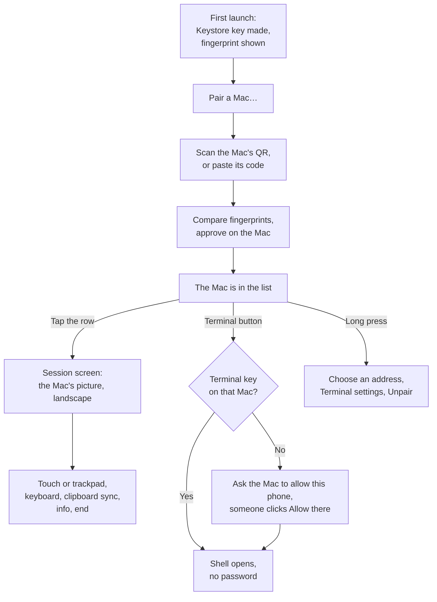

# OwnDesk on Android

The phone half of OwnDesk. It pairs with a Mac, shows that Mac's screen and drives its pointer and
keyboard, syncs the clipboard if asked to, and opens a terminal on the Mac.

The Macs can host or control. The phone only controls, which is why this app is much smaller than
`apps/owndesk`.

[../../README.md](../../README.md) is the guided tour: the technology on both platforms, the full
flow, and the user guide. This file is the app's own reference.

Kotlin 2.1 on JDK 17, plain Android Views, minSdk 26. OkHttp for the WebSocket,
kotlinx.serialization for the JSON, the Android Keystore for the identity, CameraX and zxing for
scanning, `io.github.webrtc-sdk:android` for the media, and JSch for the terminal's SSH.

## How the app fits together

## What it does today

- Makes one identity per phone, an ECDSA P-256 key generated inside the Android Keystore and never
  exportable, and shows its fingerprint on the home screen.
- Pairs by scanning the code a Mac displays, or from the same code pasted as text. The camera is
  used for nothing else, and the reading happens on the phone: a pairing code is a secret and does
  not travel anywhere to be decoded. It proves possession of the code with an HMAC and checks that
  the Mac's key hashes to the id printed in the code. Both people compare fingerprints. Until the
  Mac answers, the list shows **Waiting for *that Mac* to approve** with this phone's fingerprint,
  and a failed pairing says why in a dialog.
- Signs every signaling envelope and applies the same receiver rules as the Macs, so a replayed,
  stale, misaddressed or unsigned message is refused.
- Runs the session handshake, then offers a WebRTC connection the Mac answers, and shows the
  screen it sends.
- Sends input on the three data channels the protocol defines: pointer moves on the unordered one,
  clicks, scroll and typing on the reliable one.
- Magnifies the picture on the phone, since a desktop shrunk onto a phone has text a few pixels
  tall.
- Syncs the clipboard with the Mac, text only, once switched on.
- Opens a terminal on the Mac through its own SSH server, with a second Keystore key for the login.
- Unpairs on both sides, and learns a Mac's Tailscale addresses while at home with it.

## Using it

Tap a paired Mac to open its screen. The session screen is always landscape. Then:

| Gesture | What the Mac sees |
| --- | --- |
| Tap | left click |
| Two quick taps | double click |
| Tap twice and hold, then drag | the button stays down, which is how text is selected and windows are moved |
| Hold one finger still | right click |
| Tap with two fingers | right click |
| Tap with three fingers | middle click |
| Drag one finger | moves the pointer |
| Drag two fingers | scroll, or pan the picture while it is magnified |
| Pinch | magnifies the picture on the phone, up to four times |

The sidebar sits on the black bar beside a 16:9 picture, so it costs no part of the Mac's screen:

| Icon | What it does |
| --- | --- |
| Touch / trackpad | where the pointer goes, below |
| Keyboard | the soft keyboard; typing goes as text, and special keys as key events |
| Clipboard | clipboard sync, below |
| Info | expands the sidebar with what the session is really doing: which Mac, over which address and route, the resolution, frame rate, bitrate, codec, packets lost, jitter and round trip, read from the connection rather than guessed |
| End | asks, then drops the session |

The icons carry no labels; hold one and its name appears, which is where Android shows the name of
a control that has no caption.

These follow the conventions the established remote desktop apps settled on, so they should already
be in your hands. The one worth knowing is the drag: no app treats a plain finger drag as a drag,
because then nothing could be pointed at without dragging it. Tapping twice and holding is how you
enter it, and a blue circle appears to say the button is down.

## Touch or trackpad

**Touch** is absolute. The pointer goes where your finger lands. Quick, but a fingertip covers about
forty pixels of a desktop, so small targets are hard to hit.

**Trackpad** is relative. Your finger nudges the pointer from where it already is, like a laptop
trackpad, and a tap clicks where the pointer is. Slower to cross the screen, far easier to be
precise. The choice is remembered.

Pinching magnifies the picture on the phone and asks the Mac for nothing, so it costs no bandwidth
and works while the link is poor. The pointer stays exact while magnified.

## Clipboard sync

The clipboard icon switches it, and the choice is remembered. Android lets only the app in front
read the clipboard, so what you copy in another app goes to the Mac when you come back to OwnDesk,
and at once when you switch sync on. The Mac's clipboard comes to the phone only if that Mac shares
it with this phone: right-click the phone in the Mac's sidebar, **Share this Mac's clipboard with
it**. It is off by default there. Text only, up to 32,768 characters, never logged.

## The terminal

The **Terminal** button on a Mac's row opens a shell on that Mac. It is the Mac's own SSH server, so
**Remote Login** must be on there (System Settings → General → Sharing), and behind its ⓘ, **Allow
full disk access for remote users** lets the shell read Documents, Desktop and Downloads.

The first time, a dialog asks how to log in:

1. **Ask *that Mac* to allow this phone.** Someone at the Mac clicks **Allow**. The Mac adds the
   phone's key and answers with the account name and its host keys, so the shell opens without a
   password or a host key question from then on. The Mac needs **Let others control it** on.
2. Or by hand: **Copy the key**, or **Copy a command** that adds it to `~/.ssh/authorized_keys`, and
   run it in Terminal on the Mac once; then type the user name, as `whoami` prints it there.

Touch and hold the Mac, **Terminal settings**, to change them later or to **Forget** a pinned host
key after the Mac was reinstalled.

In the terminal:

- A key bar under it has Esc, Tab, Ctrl and Alt for the next key, the arrows, Home, End, Page Up and
  Down, a few symbols, and **PASTE**.
- A drag scrolls back through what went by; a pinch changes the text size.
- A long press selects the word under it, a path or an address taken whole. Keep dragging, or drag
  the handles, to take more. The floating menu has **Copy**, **Paste** and **Select all**; a tap
  clears the selection.
- Turned sideways, the header and status bar make way for more rows.

The Android app's SSH library cannot use an ed25519 host key, so it uses the Mac's ECDSA one, which
every Mac has unless it was removed.

## Reaching a Mac

A Mac advertises every address it has when pairing: the one on the local network, and its Tailscale
addresses. All of them are probed at once when connecting, so the phone finds the Mac whether it is
in the same room or on the other side of the world, without waiting out a timeout on the wrong
network first. Whatever answered last time is tried first the next time.

A Mac also announces its Tailscale addresses on the local network. With OwnDesk open at home, the
phone keeps them, so a Mac paired while its Tailscale was off is still found from elsewhere.

Long press a Mac in the list for its options. **Choose an address** pins one, which is what to use
when only Tailscale will reach it and the phone has not been home with the Mac since. **Use any
address** goes back to probing. The dot beside each Mac turns green when an address answers.
**Unpair this Mac** removes the pairing on both sides: the Mac is told when it can be reached, and
both must pair again. When a Mac was unpaired on its side, the phone finds out on its next
connection attempt and removes the Mac too.

Reaching a Mac over Tailscale needs Tailscale running on the phone and on that Mac, both signed
into the same tailnet.

## Build and install

Needs a JDK 17 and the Android SDK; Android Studio brings both. The Gradle wrapper is checked in.

    cd apps/android
    export JAVA_HOME="/Applications/Android Studio.app/Contents/jbr/Contents/Home"   # if no other JDK
    ANDROID_HOME=~/Library/Android/sdk ./gradlew :app:assembleDebug
    adb install -r app/build/outputs/apk/debug/app-debug.apk

`local.properties` is not checked in; either write `sdk.dir=...` into it or set `ANDROID_HOME`.
Turning on USB debugging, and the extra switch some phones want, is in the main README, section 6.3.

## Tests

    ANDROID_HOME=~/Library/Android/sdk ./gradlew :app:testDebugUnitTest

112 tests: the shared protocol vectors, the gestures, the pointer mapping under magnification, the
SDP rewriting, address preference, QR decoding, the terminal emulator and its text selection, the
SSH key encodings, pinned host keys, and the terminal key and clipboard messages.

The Gradle tests run the vectors in `packages/protocol/vectors`, the same ones the TypeScript and Swift
implementations run: device ids and fingerprints, the exact bytes an envelope signs, the pairing
proof, and sixteen receiver cases covering replay, tampering, clock skew and unknown senders. If
the phone disagrees with a vector it disagrees with both Macs, so these are the tests that matter.

Two more checks run from the repository root:

- `npm run android-frames` validates every data channel frame the app can send against the
  protocol's own JSON Schemas, using the same validator the Mac uses. Run the Gradle tests first,
  since that is what writes the frames out.
- `scripts/test-android-device.sh` installs the app on a phone over adb and runs it against the real
  host binary on this Mac: pairing, the screen, clipboard sync both ways, and the terminal, 11
  checks. It needs the phone on the same network as the Mac.

## Driving it from a computer

A debug build accepts these intent extras on `.ui.MainActivity`. A release build ignores them, so
no other app can start a pairing.

| Extra | What it does |
| --- | --- |
| `pairing_code_b64` | Pairs from a code, as base64url; then approve on the Mac |
| `connect` | Opens the screen of the Mac whose fingerprint or device id starts with this |
| `address` | With `connect` or `terminal`: pins this address first |
| `terminal` | Opens a terminal on that Mac; `ssh_user` and `ssh_port` set its login first |
| `terminal_ask` | Asks that Mac to allow this phone's terminal key, as the dialog's button does |
| `forget` | Drops that Mac from this phone alone, without telling it |
| `ssh_key` | Prints this phone's terminal key line to the log |

    # pair, passing the code from Show a code on the Mac as base64url
    adb shell am start -n io.github.im_fahad.owndesk/.ui.MainActivity \
      --es pairing_code_b64 "$(printf '%s' "$CODE" | base64 | tr '+/' '-_' | tr -d '=')"

    # connect, naming the Mac by the start of its fingerprint
    adb shell am start -n io.github.im_fahad.owndesk/.ui.MainActivity --es connect 25AA

Everything the app prints on screen also goes to logcat under the tag `OwnDesk`.

## Layout

    app/src/main/kotlin/io/github/im_fahad/owndesk/
      protocol/   encodings, identity, envelopes, receiver rules, pairing proof, payloads, key codes
      device/     the Keystore identity, the list of paired Macs, the QR decoder
      net/        the WebSocket, Bonjour discovery, and the address parsing that decides lan or cloud
      session/    pairing, unpairing, the session handshake, asking for terminal access
      media/      the WebRTC client, H.264 level query, SDP preference rewriting
      terminal/   the VT emulator, the view that draws it, the SSH shell, the terminal key, pinned host keys
      ui/         the home screen, the scanner, the session screen, the terminal screen, gestures
