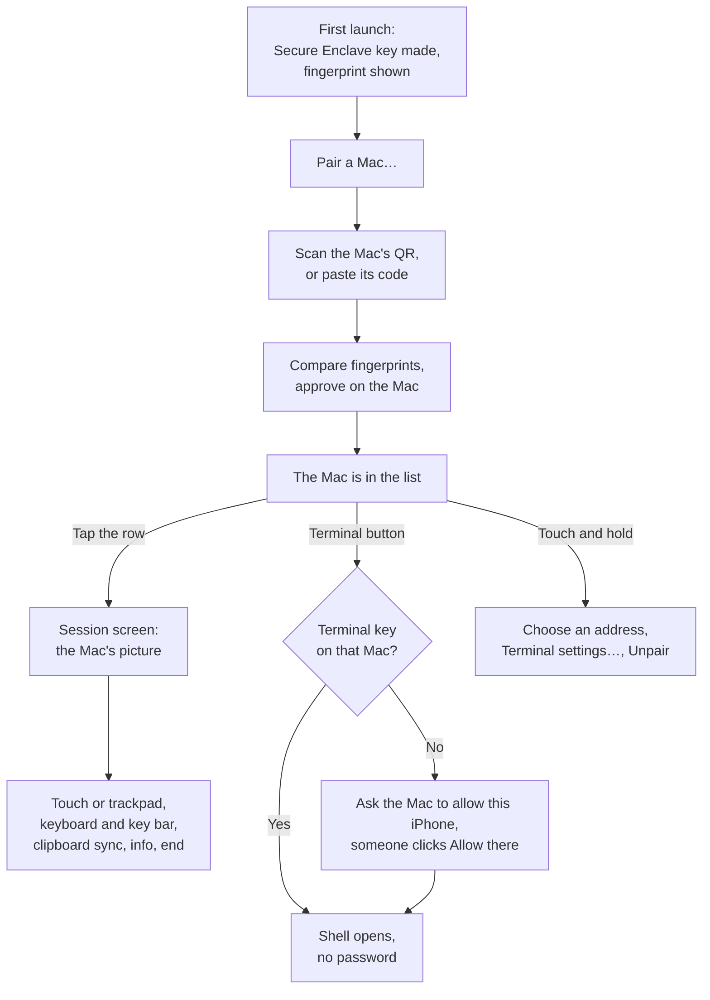

# OwnDesk on iPhone and iPad

The iPhone half of OwnDesk. Like the Android app it only controls: it pairs with a Mac, shows that
Mac's screen and drives its pointer and keyboard, syncs the clipboard if asked to, and opens a
terminal on the Mac.

[../../README.md](../../README.md) is the guided tour, and its section 6.4 is the full install guide,
with every step for signing with your own Apple ID. This file is the app's own reference.

Swift 6 toolchain in Swift 5 language mode, iOS 17+, iPhone and iPad. SwiftUI for the lists and
sheets, UIKit for the session screen. There is no protocol code here: the app links
`OwnDeskControllerCore` from `apps/mac-controller` and the Swift packages, so pairing, the signed
handshake, negotiation, keepalive, reconnection, clipboard sync and terminal key requests are the
same code the Mac controller runs. stasel/WebRTC for the media, SwiftTerm and `OwnDeskTerminal` for
the terminal.

## How the app fits together



## Build and run

**In the Simulator**, with no Apple ID and no certificate:

```sh
open apps/ios/OwnDesk.xcodeproj          # choose an iPhone simulator, press ⌘R
# or from Terminal:
xcodebuild -project apps/ios/OwnDesk.xcodeproj -scheme OwnDesk \
  -destination 'platform=iOS Simulator,name=iPhone 17' build
```

The Simulator has no camera, so pair by pasting: on the Mac, **Pair a Mac… → Show a code → Copy
code**, then `pbpaste | xcrun simctl pbcopy booted`, and on the simulated iPhone **Pair a Mac…**,
paste, **Pair**, and approve on the Mac.

**On a real iPhone or iPad**, with your own Apple ID (a free one works, but its builds stop opening
after seven days):

1. `cp Config/Local.xcconfig.example Config/Local.xcconfig`, and set your Team ID and a bundle
   identifier of your own in it. Git ignores that file.
2. Turn on Developer Mode on the iPhone, connect it, choose it in Xcode, press ⌘R.
3. Trust your Apple ID on the iPhone under **Settings → General → VPN & Device Management**, and
   allow **Local Network** and **Camera** when asked.

Never pick a team in Xcode's **Signing & Capabilities** tab: that writes it into `project.pbxproj`,
which is committed. After a device build, `git status` should show nothing changed here.

## Using it

The gestures are the Android app's, from the same rules in `OwnDeskTouch`: tap to click, two quick
taps for a double click, tap twice and hold then drag to hold the button down, hold still or tap with
two fingers for a right click, three fingers for a middle click, one finger to move the pointer, two
to scroll, pinch to magnify up to four times.

The sidebar sits beside the picture in landscape, and under it in portrait or while the keyboard is
open: touch or trackpad, keyboard, clipboard sync, info, end. The keyboard icon also brings up a bar
above the keyboard with **esc**, **tab**, the arrows and **⇧ ⌃ ⌥ ⌘**; a modifier there applies to
the next key only, so ⌘ then C is Command-C. A hardware keyboard sends every key as it is.

**Clipboard sync.** iOS lets only the app in front read the clipboard, so what you copy elsewhere
goes to the Mac when you come back to OwnDesk, and at once when you switch sync on. iOS asks before
OwnDesk reads what another app copied, unless **Paste from Other Apps** is set to Allow for OwnDesk in
Settings. The Mac's clipboard comes here only if that Mac shares it with this iPhone.

**The terminal.** The **Terminal** button on a Mac's row opens a shell through the Mac's own Remote
Login, drawn by SwiftTerm, whose bar above the keyboard gives Esc, Ctrl, Tab and the arrows. The
first time, **Ask *that Mac* to allow this iPhone** and click **Allow** on the Mac; or copy the key
or the command it shows into Terminal on the Mac once. Touch and hold the Mac, **Terminal settings…**,
to change the login later or forget a pinned host key.

## Tests

```sh
(cd OwnDeskTouch && swift test)          # gestures, pointer mapping and key tables, no simulator
../../scripts/test-ios-simulator.sh      # the app in the Simulator against a real host
```

`OwnDeskTouch` has 26 tests: the Android app's gesture and pointer cases in Swift, and the keyboard
table checked against the host's.

`scripts/test-ios-simulator.sh` builds the app and its UI tests, starts the headless agent on this
Mac with a generated screen and printed input (no permissions needed, nothing on the Mac moves), and
runs three stages, each with a pairing window of its own: the home screen; a session, where every
gesture, key and clipboard sync in both directions is checked on the host; and the terminal, where
the app asks for access, the script allows it, and a command runs on a private sshd. 5 UI tests and
16 checks. `SCREENSHOTS=<folder>` keeps the screens.

## Driving it from a computer

A debug build takes launch arguments, so pairing and connecting can be tested without typing on the
simulated phone. A release build ignores them.

| Argument | What it does |
| --- | --- |
| `-OwnDeskPairCode <base64url>` | Pairs from that code; then approve on the Mac |
| `-OwnDeskConnect <prefix>` | Opens the screen of the Mac whose fingerprint or device id starts with this |
| `-OwnDeskAddress <host:port>` | Pins that address first |
| `-OwnDeskTerminal <prefix>` | Opens that Mac's terminal |
| `-OwnDeskSSHUser <name>`, `-OwnDeskSSHPort <port>` | With `-OwnDeskTerminal`: the login to use |
| `-OwnDeskReset YES` | Forgets everything first |

```sh
xcrun simctl launch booted io.github.im-fahad.owndesk -OwnDeskConnect 25AA
```

Everything the app reports also goes to the system log under the subsystem `owndesk.ios`:
`xcrun simctl spawn booted log stream --predicate 'subsystem == "owndesk.ios"'`.

## Layout

    OwnDesk/
      OwnDeskApp.swift            the app, and the theme it shares with the Mac app (Theme.swift)
      AppModel.swift              identity, the paired Macs, Bonjour, pairing, unpairing, address pins
      HomeView.swift              the list of Macs and what this iPhone is
      PairSheet.swift             pairing: scan or paste
      QRScanner.swift             the camera, reading a pairing code
      SessionViewController.swift the picture, the touch surface, pinch, the sidebar, clipboard sync
      KeyboardCatcher.swift       the soft keyboard as text, the key bar, hardware keyboards
      TerminalSheet.swift         how to log in: ask the Mac, or the key by hand
      TerminalViewController.swift  the shell, drawn by SwiftTerm
    OwnDeskTouch/                 gestures, pointer mapping and key tables, with no UIKit
    OwnDeskUITests/               the UI tests the Simulator script runs
    Config/                       Base.xcconfig for everyone, your Local.xcconfig for signing
