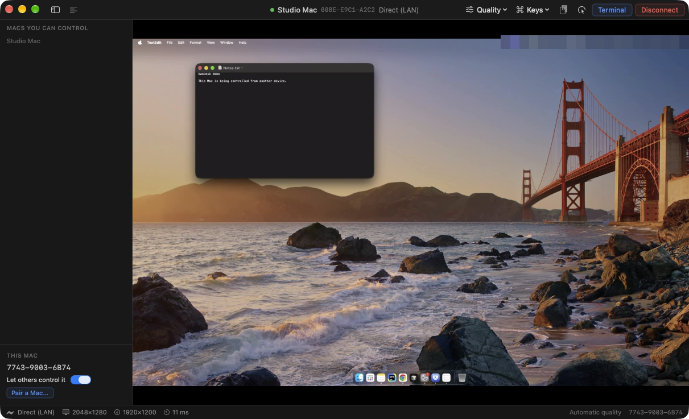

# OwnDesk

One app per Mac. It can control another Mac, be controlled by one, or both at the same time.
The libraries in `apps/mac-agent` and `apps/mac-controller` provide the two halves, and their
headless CLIs remain for testing.

[../../README.md](../../README.md) is the guided tour: the technology, the full flow from pairing to
a moving picture, and the user guide. This file is the app's own reference.



## Build and install

```sh
scripts/build-apps.sh owndesk      # dist/OwnDesk.app, ad-hoc signed; no certificate needed
scripts/install-owndesk.sh         # to ~/Applications, started in the menu bar and again at login
scripts/install-owndesk.sh --stage # copy it into place but run nothing, for a Mac you are away from
scripts/install-owndesk.sh --replace-agent   # also stop and remove an old v0.1 "PRC Agent" install
```

| Flag | Effect |
|---|---|
| `--name <text>` | Name other Macs see. Default: this Mac's name. |
| `--data-dir <path>` | Identity, peers and settings. Default `~/Library/Application Support/OwnDesk` |
| `--port <n>` | Port to listen on when hosting. Default 47500. |
| `--host` | Start with hosting on, whatever the saved setting says |
| `--background` | Start in the menu bar with no window, as the login copy does |
| `--file-identity` | Development: keep the identity in the data folder rather than the Keychain |
| `--synthetic-screen` | Test: stream a generated pattern instead of the screen |

## Hosting, and who controls whom

Hosting is off until you switch it on, so installing this never makes a Mac remotely controllable
on its own. The switch is in the sidebar under **This Mac** and in the menu bar panel. Turning it on
is also what asks for Screen Recording and Accessibility: a Mac you only control *from* never sees
those prompts.

Two paired Macs control each other: click **Connect** on either one to control the other. A single
pairing already exchanges both public keys and both people compare fingerprints, so granting both
costs nothing in trust. Each Mac still decides who may control it:

- **Let others control it**, in the sidebar, turns all control of this Mac on or off.
- **Allow it to control this Mac**, in a device's right-click menu, is on after pairing and turns one
  device off. That device stays paired and is told why when it tries: "Mac mini has turned off
  control for this Mac", with the switch to change. Its row here says it can't control this Mac.

To end a pairing, unpair it. A phone only ever controls, so it is listed under "Devices that can
control this one", with the same switch.

- **Share this Mac's clipboard with it**, in the same menu, is off after pairing. On, that device
  gets this Mac's clipboard while it has clipboard sync switched on during a session: once when the
  sync starts, then on every change. What a device copies reaches this Mac without it.

The clipboard button in the header switches clipboard sync for the Mac you are controlling. It is
text only, and nothing about it is logged beyond how many characters went which way.

Pair from either end: **Show a code** on one Mac and paste it on the other. A phone pairs from the
same code, by scanning the QR with its camera. **Show full screen** fills the display with the code
for a phone that struggles with the small one; it closes on a click, on Esc, or by itself when the
phone's request arrives. Once a pairing completes, on either Mac, the sheet says **Paired with *that
device*** for a moment and closes, so the new device in the sidebar is what you see next.

**Connect** finds the other Mac by itself: Bonjour on the same network, then every address it is
known by, at once. Where one route matters, as a Mac reachable away from home only over Tailscale,
click the address beside **Connect** (it reads **Any address** until one is chosen), or choose
**Choose an address…** in the Mac's right-click menu. The sheet lists each known address with what
it is for (on this network now, local network, Tailscale); click one, or type one, and **Use it**.
The choice is kept for that Mac and used by the terminal too. It is tried first, and when it does
not answer the others still are. **Use any address** clears it.

**Unpair…** in a device's right-click menu, or the ⓧ that appears on hover, ends the pairing on both
sides, and both must pair again. Another Mac is told at once with a signed `UNPAIR` when it can be
reached; a phone finds out the next time it tries to connect, when this Mac turns it away. If the
other device cannot be reached, OwnDesk says so, and you unpair it there too.

## The window, and the menu bar

The app lives in the menu bar and only claims a Dock icon while a window is open, so a Mac started
at login adds nothing to the Dock, and an open window can still take keyboard focus.

| Action | What happens |
|---|---|
| Close the window, or ⌘W | It goes away, and so does the Dock icon. The menu bar item stays, and hosting keeps running. |
| **Open OwnDesk…** in the menu bar | The window comes back |
| Double click the header | Zooms, or whatever "double-click a window's title bar to" is set to in System Settings |
| Drag the header | Moves the window |
| **Quit** | Really quits: the launch agent brings the app back after a crash, never after Quit |

While no session is live, the last picture stays behind a blur, under a card with **Connect** and
the reason the session ended, so a stale screen is never mistaken for the live one.

## The terminal

**Terminal** in the header, ⌘T, the icon that appears on a paired Mac's row, or **Open Terminal** in
its right-click menu opens a shell on that Mac in a window of its own. It is the Mac's own SSH
server: turn on **Remote Login** there (System Settings → General → Sharing), and behind its ⓘ
**Allow full disk access for remote users**, or the shell cannot read Documents, Desktop or Downloads.

The first time, a sheet asks how to log in. **Ask *that Mac* to allow this Mac** sends the request;
someone at the other Mac clicks **Allow**, and it answers with the account name and its host keys,
so the terminal opens without a password or a host key question from then on. By hand instead: the
sheet copies this Mac's key, or a command that adds it to `~/.ssh/authorized_keys` there, and takes
the user name, as `whoami` prints it. Without a key, the account's password is asked for each time.
**Terminal settings…** in the row's menu brings the sheet back.

When another device asks this Mac, the window comes forward with **Terminal access**: its name, its
fingerprint, its key's fingerprint and the account. **Allow** adds that key to this account's
`~/.ssh/authorized_keys`, in a line tagged with the device; **Deny** or two minutes without an
answer adds nothing. Unpairing the device removes its tagged line again and leaves any key added by
hand alone. The script channel cannot answer the question.

The first connection shows the other Mac's host key fingerprint and asks whether to trust it; after
that the key is pinned, and a different one is refused with an explanation. **Forget it** in the
settings clears the pin, for a Mac whose key really changed.

The window is an ordinary one: ⌘C and ⌘V work, ⌘W closes it and ends the shell, the shell sees the
window's real size, and several can be open at once. The terminal does not depend on the "Allow it
to control this Mac" switch, which is about the screen. Nothing typed goes through OwnDesk's own
protocol, and the script channel below has no terminal command, by design.

## Where its data lives

`~/Library/Application Support/OwnDesk`: the identity, the peer list, settings, `control.json` for
the script channel, `ssh-key.json` (the terminal key, an opaque Secure Enclave reference on a Mac
that has one) and `known-hosts.json` (the other Macs' pinned SSH host keys). Logs are in
`~/Library/Logs/OwnDesk`. Nothing there is a secret except the two keys and the token in `control.json`.
Outside it, OwnDesk touches only lines tagged `owndesk-…` in `~/.ssh/authorized_keys`, and only after
an **Allow**.

## Upgrading from PRC

OwnDesk was called PRC until September 2026. `scripts/install-owndesk.sh` stops and removes
`PRC.app`, and the first launch takes over `~/Library/Application Support/PRC` and the old app's
settings, so the Mac keeps its identity, its pairings, and its hosting switch. macOS treats the new
bundle id as a new app, so grant Screen Recording and Accessibility again. The phone app has a new
application id too: install it, pair it once more, and forget the old phone entry on each Mac.

## Migrating from the v0.1 split apps

The first launch brings forward whichever of the old v0.1 apps ran on this Mac: its identity, so other
Macs still recognise it, and its pairings. The old stores recorded one direction each; a pairing
between two Macs now covers both, so after upgrading each can control the other.

## Driving it from a script

`control.json` in the data folder carries a loopback port and a token, and the CLI in
`apps/mac-controller` speaks to it:

```sh
owndesk-controller-cli app status | peers | hosting off
owndesk-controller-cli app pending | deny
owndesk-controller-cli app connect <peer> [address] | disconnect | end-incoming | stats
owndesk-controller-cli app allow <peer> off | unpair <peer> | forget <peer>
owndesk-controller-cli app quality <preset> | panels [sidebar|log|text] | quit
```

Any program running as you can read that token, and OwnDesk holds Screen Recording and Accessibility.
So the channel can only take access away. Switching hosting on, showing or using a pairing code,
approving a pairing, and granting a permission are clicks in the app. On a Mac without a display,
make them over Screen Sharing.
